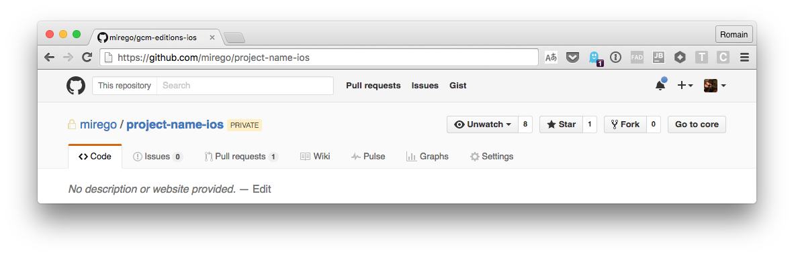
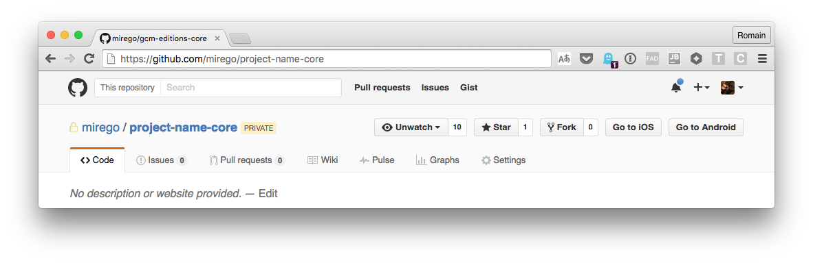

# Carlito

A Chrome extension to swift from Core to iOS / Android repositories. 
At [Mirego](http://www.mirego.com/en) most of our mobile projects share a codebase using 
[j2objc](https://github.com/google/j2objc). Our projects usually use the following nomanclature:

	* iOS: mirego/project-name-ios
	* Android: mirego/project-name-android
	* Core: mirego/project-name-core

(Where Core is the shared codebase.)

## Use it

Go to the [Releases](https://github.com/Palleas/Carlito/releases) page and download the latest zip. It will
contain a **crx** file that you can double click on to install the extension.
You can also clone the repository, go to `chrome://extensions` and select "Load unpackaged extension", which
is more convenient (and the only way) to use the extension in dev mode and contribute.

## TODOs

* [ ] Support Safari
* [ ] Package and release the extension via the command line
* [ ] Add settings to allow more organizations 
